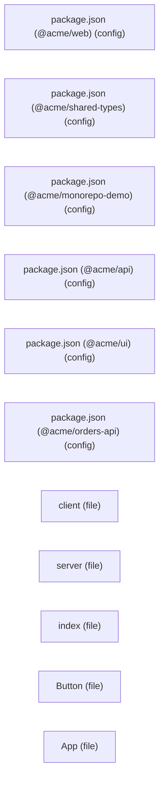
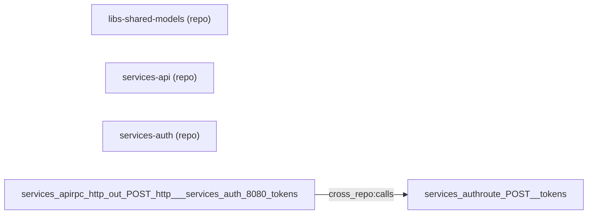

# Graph visualization examples

Real terminal output from running `wd` against the demo workspaces shipped
in `scripts/`. Every snippet on this page was captured verbatim from a
clean run of those scripts plus the listed `wd` commands; nothing here
is hand-written or invented. Paths from the capture host have been
sanitized to `/tmp/weld-demo` for readability.

The [Reproducing locally](#reproducing-locally) section at the bottom
lists the exact commands and order to regenerate everything.

## Contents

- [Monorepo graph](#monorepo-graph)
- [Polyrepo workspace and `repo:` nodes](#polyrepo-workspace-and-repo-nodes)
- [Agent Graph](#agent-graph)
- [MCP config snippet](#mcp-config-snippet)
- [Reproducing locally](#reproducing-locally)

---

## Monorepo graph

Source: a fresh workspace from `scripts/create-monorepo-demo.sh`,
which lays down a small TypeScript-flavored monorepo (`apps/web`,
`packages/ui`, `packages/api`, `libs/shared-types`,
`services/orders-api`).

### `wd discover`

First run on a clean tree, then a no-op rerun:

```text
[weld] notice: no graph.json found, running full discovery
[weld] notice: no files changed, graph is up to date
```

### `wd graph stats`

```json
{
  "total_nodes": 11,
  "total_edges": 0,
  "nodes_by_type": { "config": 6, "file": 5 },
  "edges_by_type": {},
  "nodes_with_description": 0,
  "description_coverage_pct": 0.0,
  "top_authority_nodes": [
    {
      "id": "config:apps_web_package_json",
      "label": "package.json (@acme/web)",
      "type": "config",
      "in_degree": 0,
      "out_degree": 0,
      "degree": 0
    }
  ]
}
```

(`top_authority_nodes` truncated to one entry; the live command returns
five by default, tunable with `--top`.)

### `wd find "Button"` (after `wd build-index`)

```json
{
  "query": "Button",
  "files": [
    {
      "path": "packages/ui/src/Button.tsx",
      "tokens": ["Button", "ButtonProps"],
      "score": 2
    }
  ]
}
```

### `wd query "orders-api"` (excerpt)

```json
{
  "query": "orders-api",
  "matches": [
    {
      "id": "config:services_orders-api_package_json",
      "label": "package.json (@acme/orders-api)",
      "props": {
        "authority": "canonical",
        "confidence": "definite",
        "file": "services/orders-api/package.json",
        "package_name": "@acme/orders-api",
        "roles": ["config"],
        "source_strategy": "manifest"
      },
      "type": "config"
    },
    {
      "id": "file:orders-api/src/server",
      "label": "server",
      "props": {
        "authority": "derived",
        "confidence": "inferred",
        "exports": ["createOrder", "getOrder", "listOrders"],
        "file": "services/orders-api/src/server.ts",
        "line_count": 13,
        "roles": ["implementation"],
        "source_strategy": "typescript_exports"
      },
      "type": "file"
    }
  ]
}
```

### `wd context file:orders-api/src/server`

```json
{
  "node": {
    "id": "file:orders-api/src/server",
    "label": "server",
    "props": {
      "authority": "derived",
      "confidence": "inferred",
      "exports": ["createOrder", "getOrder", "listOrders"],
      "file": "services/orders-api/src/server.ts",
      "line_count": 13,
      "roles": ["implementation"],
      "source_strategy": "typescript_exports"
    },
    "type": "file"
  },
  "neighbors": [],
  "edges": []
}
```

### `wd export --format mermaid`

The same graph rendered as a Mermaid flowchart (full `wd export`
output):



`wd export` also supports `--format dot` (Graphviz) and `--format d2`,
plus `--node` / `--depth` to extract a subgraph centered on a specific
node.

---

## Polyrepo workspace and `repo:` nodes

Source: a fresh workspace from `scripts/create-polyrepo-demo.sh`. The
demo is three nested git repos under one root: `services/api` calls
`services/auth`'s `POST /tokens` endpoint, and both depend on
`libs/shared-models`.

### `wd workspace status`

Default human-readable view of the workspace child ledger:

```text
Workspace status (3 children)
Counts: present=3, missing=0, uninitialized=0, corrupt=0
libs-shared-models: present dirty (refs/heads/main dcfef211fb30)
services-api: present dirty (refs/heads/main ba6870664d17)
services-auth: present dirty (refs/heads/main d712c4d621fb)
```

Each line is `<child-name>: <lifecycle-state> [dirty?] (<head-ref>
<short-sha>)`. Lifecycle states are `present`, `missing`,
`uninitialized`, or `corrupt`.

### `wd workspace status --json` (one of three children shown)

```json
{
  "children": {
    "libs-shared-models": {
      "graph_path": "libs/shared-models/.weld/graph.json",
      "graph_sha256": "be8c5536c1f160332fc6436e7c28cb416085fdc79456cd5dabbadd90e2e2d2f1",
      "head_ref": "refs/heads/main",
      "head_sha": "dcfef211fb3010c810d81b35d12ee433a9bf0b70",
      "is_dirty": true,
      "last_seen_utc": "2026-04-25T13:28:16Z",
      "status": "present"
    }
  }
}
```

### Federation graph: `wd graph stats`

After running `wd discover` in each child, then once at the root, the
root meta-graph contains one `repo:` node per child plus any cross-repo
edges the configured strategies emitted. Here the `service_graph`
cross-repo strategy produced a single `cross_repo:calls` edge:

```json
{
  "total_nodes": 3,
  "total_edges": 1,
  "nodes_by_type": { "repo": 3 },
  "edges_by_type": { "cross_repo:calls": 1 }
}
```

### `repo:` nodes via `wd list --type repo` (two of three shown)

```json
[
  {
    "id": "repo:libs-shared-models",
    "label": "libs-shared-models",
    "props": {
      "authority": "canonical",
      "confidence": "definite",
      "depth": 2,
      "path": "libs/shared-models",
      "source_strategy": "federation_root",
      "tags": { "category": "libs" }
    },
    "type": "repo"
  },
  {
    "id": "repo:services-api",
    "label": "services-api",
    "props": {
      "authority": "canonical",
      "confidence": "definite",
      "depth": 2,
      "path": "services/api",
      "source_strategy": "federation_root",
      "tags": { "category": "services" }
    },
    "type": "repo"
  }
]
```

### Cross-repo edge from `wd dump`

```json
{
  "edges": [
    {
      "from": "services-apirpc:http:out:POST:http://services-auth:8080/tokens",
      "props": {
        "host": "services-auth",
        "method": "POST",
        "path": "/tokens",
        "port": 8080,
        "source_strategy": "service_graph"
      },
      "to": "services-authroute:POST:/tokens",
      "type": "cross_repo:calls"
    }
  ]
}
```

The `` byte (ASCII unit separator) in `from` and `to` namespaces
each endpoint to its child repo. `services-api`'s outbound HTTP call to
`POST http://services-auth:8080/tokens` resolves to `services-auth`'s
`POST /tokens` route.

### `wd export --format mermaid` (polyrepo)

The same federated graph as a Mermaid flowchart. (`wd export` emits
the cross-repo edge endpoints with unit-separator bytes intact; some
Markdown viewers strip those bytes when rendering, so the displayed
identifiers may look run-together compared to the JSON form above.)



---

## Agent Graph

Source: the `examples/agent-graph-demo/` workspace shipped with Weld,
which mixes Claude Code, Cursor, Gemini CLI, GitHub Copilot, and
OpenCode customization files (with deliberate inconsistencies for the
audit step to flag).

### `wd agents discover`

```text
Agent Graph discovery
Root: .
Assets: 20
Nodes: 35
Edges: 38
Diagnostics: 2
Write: .weld/agent-graph.json
```

### `wd agents list` (Claude Code and GitHub Copilot sections)

```text
Claude Code
  agent        planner                  .claude/agents/planner.md [generated] - Drafts implementation plans for Claude Code.
  agent        reviewer                 .claude/agents/reviewer.md [manual] - Reviews dependency security risk.
  config       settings                 .claude/settings.json [manual]
  hook         PostToolUse-1            .claude/settings.json#/hooks/PostToolUse/0 [manual] - Record tool use without executing project code; rollback by deleting the log.
  instruction  claude                   CLAUDE.md [manual]
  skill        architecture-decision    .claude/skills/architecture-decision/SKILL.md [manual] - Records architecture decision impact.
  skill        pr-review                .claude/skills/pr-review/SKILL.md [manual] - helper
  skill        security-review          .claude/skills/security-review/SKILL.md [manual] - Reviews dependency security risk.

GitHub Copilot / VS Code
  agent        planner                  .github/agents/planner.agent.md [canonical] - Produces implementation plans before code changes.
  agent        reviewer                 .github/agents/reviewer.agent.md [manual] - Reviews dependency security risk.
  instruction  copilot-instructions     .github/copilot-instructions.md [manual]
  instruction  cpp                      .github/instructions/cpp.instructions.md [manual] - C++ naming and structure guidance.
  instruction  testing                  .github/instructions/testing.instructions.md [manual] - Test guidance for implementation changes.
  prompt       create-plan              .github/prompts/create-plan.prompt.md [manual] - Produces implementation plans before code changes.
```

(Two of five platform sections shown. The full output also covers
Cursor, Gemini CLI, Generic, and OpenCode.) The bracketed tag
(`[manual]`, `[generated]`, `[canonical]`) is the asset's authority
status.

### `wd agents explain planner` (excerpt)

```text
planner
Type: agent
Status: canonical
Platforms:
  - Claude Code: .claude/agents/planner.md
  - Gemini CLI: .gemini/agents/planner.md
  - GitHub Copilot / VS Code: .github/agents/planner.agent.md
  - OpenCode: opencode.json#/agents/planner
Purpose:
  - Produces implementation plans before code changes.
Source files:
  - .github/agents/planner.agent.md
Outgoing references:
  - handoff_to -> agent:reviewer (agent:github-copilot:reviewer)
  - provides_tool -> tool:editFiles (tool:generic:editfiles)
  - provides_tool -> tool:search (tool:generic:search)
  - references_file -> file:docs/architecture/missing.md
  - uses_skill -> skill:architecture-decision (skill:claude:architecture-decision)
Incoming references:
  - generated_from -> agent:planner (agent:claude:planner)
  - generated_from -> agent:planner (agent:gemini:planner)
  - invokes_agent -> prompt:create-plan (prompt:github-copilot:create-plan)
```

The full output additionally lists `Related` skills and `Potential
overlap` siblings that share the same name or description.

### `wd agents audit` (first four findings)

The demo includes deliberate inconsistencies, so the audit returns a
mix of `info` and `warning` findings:

```text
Agent Graph audit findings:
1. Unused skill
   Severity: info
   Code: unused_skill
   - skill:pr-review at .claude/skills/pr-review/SKILL.md
   Skill has no incoming uses_skill references.
2. Broken reference
   Severity: warning
   Code: broken_reference
   - agent:planner at .github/agents/planner.agent.md
   Referenced file does not exist: docs/architecture/missing.md
3. Duplicate asset name
   Severity: warning
   Code: duplicate_name
   - agent:planner at .claude/agents/planner.md
   - agent:planner at .gemini/agents/planner.md
   - agent:planner at .github/agents/planner.agent.md
   - agent:planner at opencode.json#/agents/planner
   Multiple agent assets share name 'planner'.
4. Platform variant drift
   Severity: warning
   Code: platform_drift
   - agent:planner at .claude/agents/planner.md
   - agent:planner at .gemini/agents/planner.md
   - agent:planner at .github/agents/planner.agent.md
   - agent:planner at opencode.json#/agents/planner
   Same-name platform variants have different descriptions.
```

The full audit on this demo emits 23 findings spanning duplicate names,
platform variant drift, rendered-copy drift, broken references,
unsafe-hook descriptions, vague skill descriptions, tool-permission
conflicts, and path-scope overlaps. See [`docs/agent-graph.md`](agent-graph.md)
for the full list of finding codes.

---

## MCP config snippet

`wd mcp config --client=<name>` prints the JSON snippet your MCP-aware
client needs in order to talk to the Weld stdio server. The same
command writes the file in place when invoked with `--write`.

Claude Code and Cursor share the same shape, keyed on `mcpServers`:

```json
{
  "mcpServers": {
    "weld": {
      "command": "python",
      "args": [
        "-m",
        "weld.mcp_server"
      ]
    }
  }
}
```

VS Code uses `servers` instead:

```json
{
  "servers": {
    "weld": {
      "command": "python",
      "args": [
        "-m",
        "weld.mcp_server"
      ]
    }
  }
}
```

The full MCP install story (including the `[mcp]` extra) is covered in
[`docs/mcp.md`](mcp.md).

---

## Reproducing locally

Snippets on this page were captured against `wd 0.13.0` from a Linux
host. To reproduce them on your own machine:

```bash
# 0. Install Weld and make sure git identity is configured globally:
#    git config --global user.name  "Your Name"
#    git config --global user.email "you@example.com"

# 1. Materialize the demo workspaces.
scripts/create-monorepo-demo.sh /tmp/weld-demo/monorepo
scripts/create-polyrepo-demo.sh /tmp/weld-demo/polyrepo

# 2. Monorepo discovery + queries.
cd /tmp/weld-demo/monorepo
wd discover --output .weld/graph.json
wd build-index
wd graph stats
wd find "Button"
wd query "orders-api"
wd context file:orders-api/src/server
wd export --format mermaid

# 3. Polyrepo discovery + federation.
cd /tmp/weld-demo/polyrepo
for child in services/api services/auth libs/shared-models; do
  (cd "$child" && wd discover --output .weld/graph.json)
done
wd discover --output .weld/graph.json
wd workspace status
wd workspace status --json
wd list --type repo
wd export --format mermaid

# 4. Agent Graph against the bundled demo.
cp -r examples/agent-graph-demo /tmp/weld-demo/agent-graph
cd /tmp/weld-demo/agent-graph
wd agents discover
wd agents list
wd agents explain planner
wd agents audit

# 5. MCP config snippet (no workspace required).
wd mcp config --client=claude
wd mcp config --client=cursor
wd mcp config --client=vscode
```

Output formatting (whitespace, key ordering inside JSON objects) is
deterministic for a given `wd` version, so reruns produce the same
text aside from `head_sha` / `last_seen_utc` style fields that depend
on the demo's freshly-created git history.
